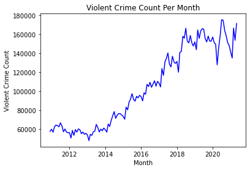
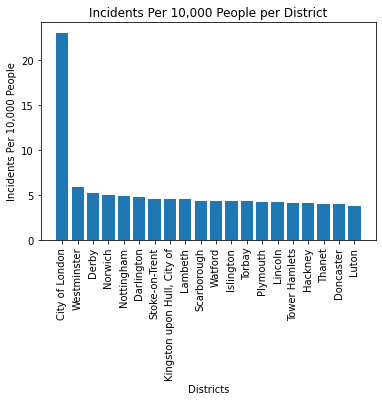
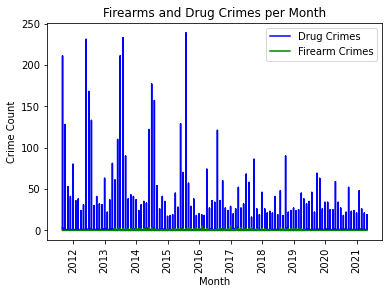
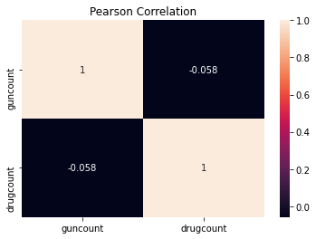
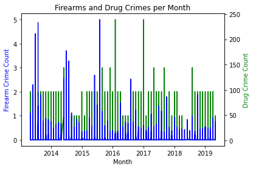
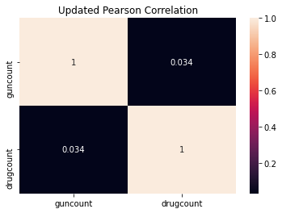

Writeup and code base demonstrating big data techniques.

# The Crime Analysis Task


# 1) Introduction

Crime is a social problem that affects economic development and the quality of life in society [1]. This issue is facilitated by a setting that allows people to feel vulnerable to victimisation [2]. With the use of geographic and crime data information, insight into these crimes can be established [3]. Although this opportunity is possible, the limitations involved in crime datasets make its analysis difficult [4].

The limitations typically involve incomplete and inconsistent data, as well as restrictions on accessing crime data records from Law Enforcement departments. Another issue is how conclusions are derived from the dataset. Crime rate calculations that are taken based on area population may not represent that area correctly [3]. This can be caused by criminals travelling from one area to commit acts in another community. Because of situations like this, some conclusions that can be made from data may be inherently flawed.

This assignment aims to evaluate the claims made in a documentary broadcasted on the 6th of September 2018 called “Ross Kemp and the Armed Police”, regarding violent crimes in the Uk. These claims were that there is an increase in Violent Crime, there are more firearm incidents per head in Birmingham than anywhere else in the UK and that firearm crime are closely associated with drug offences.

With the Street Level Crime data published by the UK Home Office, a review of the validity of the claims made will be performed. To do this each claim will be reviewed with the use of a publicly accessible crime dataset provided by the UK home office, and several statistical geographic data collected through census data.

# 2) Component Selection and Data Pipeline Implementation


```python
# Importing the required libaries for the Pipeline and Filtering sections
from pyspark.sql import SparkSession
from pyspark.sql.types import *
from pyspark.sql.functions import *
from pyspark.sql.functions import col
import pandas as pd

# Creating the Apache Spark distribution environment variables
spark = SparkSession \
    .builder \
    .appName("KF7032 Assignment") \
    .config("spark.some.config.option", "some-value") \
    .getOrCreate()

sc = spark.sparkContext
```


```python
# Creating a String array containing all the locations for the datasets used in the assignment
# Please follow storage conventions!
dataset = ["maindata/Sample_1pc_Data.csv","maindata/UK-HPI-full-file-2017-08.csv", \
           "maindata/postcodes.csv","maindata/LSOA_pop_v2.csv","maindata/all_crimes21_hdr.txt"]

# The schema used for the postcode dataset which contained no header information
postcodeschema = StructType(
    [StructField("Postcode",StringType(),True),
     StructField("InUse",StringType(),True),
     StructField("Latitude",StringType(),True),
     StructField("Longitude",StringType(),True),
     StructField("Easting",StringType(),True),
     StructField("Northing",StringType(),True),
     StructField("GridRef",StringType(),True),
     StructField("County",StringType(),True),
     StructField("District",StringType(),True),
     StructField("Ward",StringType(),True),
     StructField("DistrictCode",StringType(),True),
     StructField("WardCode",StringType(),True),
     StructField("Country",StringType(),True),
     StructField("CountyCode",StringType(),True),
     StructField("Constituency",StringType(),True),
     StructField("Introduced",StringType(),True), 
     StructField("Terminated",StringType(),True),
     StructField("Parish",StringType(),True),
     StructField("NationalPark",StringType(),True),
     StructField("Population",StringType(),True),
     StructField("Households",StringType(),True),
     StructField("BuiltUpArea",StringType(),True),
     StructField("Builtupsubdivision",StringType(),True),
     StructField("Lowerlayersuperoutputarea",StringType(),True),
     StructField("Rural/urban",StringType(),True),
     StructField("Region",StringType(),True),
     StructField("Altitude",StringType(),True)])

# Method for loading in datasets,  both those with and without headers
def load_dataset(filename, head, newschema):
    
    if (head == "False"):
        return spark.read.load(filename,
                               format = "csv", sep = ",", 
                               schema = newschema, header=head)
    return spark.read.load(filename,
        format = "csv", sep = ",",
        header=head)
```


```python
# Using the load_dataset method to load the datasets into variables with some
# column renames to avoid errors in later use.
crimedf = load_dataset(dataset[4], "True", None) \
        .withColumnRenamed('Crime Type', 'crimetype') \
        .withColumnRenamed('Last outcome category','outcome') \
        .withColumnRenamed('LSOA code','LSOAcode')

hpidf = load_dataset(dataset[1], "True" , None)

postdf = load_dataset(dataset[2], "False", postcodeschema)


lsoadf = load_dataset(dataset[3], "True", None).withColumnRenamed('geography code','geoCode') \
        .withColumnRenamed('Variable: All usual residents; measures: Value','geoPop') 
        
lsoadf = lsoadf.withColumn("geoPop",lsoadf.geoPop.cast(IntegerType()))
```


```python
# Reviewing the varible names and types to ensure they are correct before moving on
crimedf.printSchema()
postdf.printSchema()
lsoadf.printSchema()

```

    root
     |-- Crime ID: string (nullable = true)
     |-- Month: string (nullable = true)
     |-- Reported by: string (nullable = true)
     |-- Falls within: string (nullable = true)
     |-- Longitude: string (nullable = true)
     |-- Latitude: string (nullable = true)
     |-- Location: string (nullable = true)
     |-- LSOAcode: string (nullable = true)
     |-- LSOA name: string (nullable = true)
     |-- crimetype: string (nullable = true)
     |-- outcome: string (nullable = true)
     |-- Context: string (nullable = true)
    
    root
     |-- Postcode: string (nullable = true)
     |-- InUse: string (nullable = true)
     |-- Latitude: string (nullable = true)
     |-- Longitude: string (nullable = true)
     |-- Easting: string (nullable = true)
     |-- Northing: string (nullable = true)
     |-- GridRef: string (nullable = true)
     |-- County: string (nullable = true)
     |-- District: string (nullable = true)
     |-- Ward: string (nullable = true)
     |-- DistrictCode: string (nullable = true)
     |-- WardCode: string (nullable = true)
     |-- Country: string (nullable = true)
     |-- CountyCode: string (nullable = true)
     |-- Constituency: string (nullable = true)
     |-- Introduced: string (nullable = true)
     |-- Terminated: string (nullable = true)
     |-- Parish: string (nullable = true)
     |-- NationalPark: string (nullable = true)
     |-- Population: string (nullable = true)
     |-- Households: string (nullable = true)
     |-- BuiltUpArea: string (nullable = true)
     |-- Builtupsubdivision: string (nullable = true)
     |-- Lowerlayersuperoutputarea: string (nullable = true)
     |-- Rural/urban: string (nullable = true)
     |-- Region: string (nullable = true)
     |-- Altitude: string (nullable = true)
    
    root
     |-- date: string (nullable = true)
     |-- geography: string (nullable = true)
     |-- geoCode: string (nullable = true)
     |-- Rural Urban: string (nullable = true)
     |-- geoPop: integer (nullable = true)
     |-- Variable: Males; measures: Value: string (nullable = true)
     |-- Variable: Females; measures: Value: string (nullable = true)
     |-- Variable: Lives in a household; measures: Value: string (nullable = true)
     |-- Variable: Lives in a communal establishment; measures: Value: string (nullable = true)
     |-- Variable: Schoolchild or full-time student aged 4 and over at their non term-time address; measures: Value: string (nullable = true)
     |-- Variable: Area (Hectares); measures: Value: string (nullable = true)
     |-- Variable: Density (number of persons per hectare); measures: Value: string (nullable = true)
    
    

# 3) Data Extraction and Filtering

<a id='Claim_1'></a>

### Violent Crime Data Extraction and Filtering


```python
# Filtering crimedf on violent crimes.
violentCrimes = crimedf.filter((crimedf.crimetype == "Violence and sexual offences") | \
                            (crimedf.crimetype == "Violent crime"))

# Grouping crimes by month and counting the number of crimes that occured in those months,
# converting the dataframe to a Pandas dataframe.
violentCrimes = violentCrimes.groupBy('Month').agg({"crimetype": "count"}).toPandas()

# Casting the Month collumn to a Data format for visulation.
violentCrimes['Month'] = pd.to_datetime(violentCrimes['Month'])

#Sorting the Month earliest to latest for visualisation.
violentCrimes.sort_values(by='Month', inplace=True)

```


```python
# Reviewing the dataframe to ensure it is correctly formatted.
display(violentCrimes)
```


<div>
<style scoped>
    .dataframe tbody tr th:only-of-type {
        vertical-align: middle;
    }

    .dataframe tbody tr th {
        vertical-align: top;
    }

    .dataframe thead th {
        text-align: right;
    }
</style>
<table border="1" class="dataframe">
  <thead>
    <tr style="text-align: right;">
      <th></th>
      <th>Month</th>
      <th>count(crimetype)</th>
    </tr>
  </thead>
  <tbody>
    <tr>
      <th>1</th>
      <td>2010-12-01</td>
      <td>57580</td>
    </tr>
    <tr>
      <th>0</th>
      <td>2011-01-01</td>
      <td>59823</td>
    </tr>
    <tr>
      <th>3</th>
      <td>2011-02-01</td>
      <td>56691</td>
    </tr>
    <tr>
      <th>2</th>
      <td>2011-03-01</td>
      <td>62326</td>
    </tr>
    <tr>
      <th>5</th>
      <td>2011-04-01</td>
      <td>64299</td>
    </tr>
    <tr>
      <th>...</th>
      <td>...</td>
      <td>...</td>
    </tr>
    <tr>
      <th>121</th>
      <td>2021-01-01</td>
      <td>141414</td>
    </tr>
    <tr>
      <th>123</th>
      <td>2021-02-01</td>
      <td>135101</td>
    </tr>
    <tr>
      <th>122</th>
      <td>2021-03-01</td>
      <td>166668</td>
    </tr>
    <tr>
      <th>124</th>
      <td>2021-04-01</td>
      <td>153789</td>
    </tr>
    <tr>
      <th>125</th>
      <td>2021-05-01</td>
      <td>171614</td>
    </tr>
  </tbody>
</table>
<p>126 rows × 2 columns</p>
</div>


<a id='Claim_2'></a>

### Prosecuted Gun Crime Data Extraction and Filtering


```python
# Filtering crime dataframe on weapon crimes that resulted in prison sentances.
firearmCrimes = crimedf.filter((crimedf.crimetype == "Possession of weapons") & \
                              (crimedf.outcome == "Offender sent to prison"))

# Selecting only the required columns from Postcode dataframe
districts = postdf.select("Lowerlayersuperoutputarea","District")
# Removing the duplicated from "Lowerlayersuperoutputarea" column.
districts = districts.dropDuplicates(["Lowerlayersuperoutputarea"])
# Selecting only the required columns from LSOA dataframe
lsaoPop = lsoadf.select("geography", "geoCode", "geoPop")
```


```python
# Reviewing the dataframes to ensure it is correctly formatted.
display(firearmCrimes.toPandas())
display(lsaoPop.toPandas())
display(districts.toPandas())
```


<div>
<style scoped>
    .dataframe tbody tr th:only-of-type {
        vertical-align: middle;
    }

    .dataframe tbody tr th {
        vertical-align: top;
    }

    .dataframe thead th {
        text-align: right;
    }
</style>
<table border="1" class="dataframe">
  <thead>
    <tr style="text-align: right;">
      <th></th>
      <th>Crime ID</th>
      <th>Month</th>
      <th>Reported by</th>
      <th>Falls within</th>
      <th>Longitude</th>
      <th>Latitude</th>
      <th>Location</th>
      <th>LSOAcode</th>
      <th>LSOA name</th>
      <th>crimetype</th>
      <th>outcome</th>
      <th>Context</th>
    </tr>
  </thead>
  <tbody>
    <tr>
      <th>0</th>
      <td>0b3b9b6734d5d39e01a3e55ffb94561a45398157f4fec2...</td>
      <td>2013-05</td>
      <td>Avon and Somerset Constabulary</td>
      <td>Avon and Somerset Constabulary</td>
      <td>-2.595297</td>
      <td>51.490694</td>
      <td>On or near Wellington Hill West</td>
      <td>E01014636</td>
      <td>Bristol 004D</td>
      <td>Possession of weapons</td>
      <td>Offender sent to prison</td>
      <td>None</td>
    </tr>
    <tr>
      <th>1</th>
      <td>847bb34d1477d850d45cf31f7caa6b784ff381b87ce3e6...</td>
      <td>2013-05</td>
      <td>Avon and Somerset Constabulary</td>
      <td>Avon and Somerset Constabulary</td>
      <td>-2.516680</td>
      <td>51.476465</td>
      <td>On or near Briar Walk</td>
      <td>E01014629</td>
      <td>Bristol 018D</td>
      <td>Possession of weapons</td>
      <td>Offender sent to prison</td>
      <td>None</td>
    </tr>
    <tr>
      <th>2</th>
      <td>1de0400a0b6d75375d030a2e42421ffa84566c0449ea68...</td>
      <td>2013-05</td>
      <td>Avon and Somerset Constabulary</td>
      <td>Avon and Somerset Constabulary</td>
      <td>-2.576030</td>
      <td>51.470514</td>
      <td>On or near Mina Road</td>
      <td>E01014485</td>
      <td>Bristol 023A</td>
      <td>Possession of weapons</td>
      <td>Offender sent to prison</td>
      <td>None</td>
    </tr>
    <tr>
      <th>3</th>
      <td>5535a74b05f0e7d0dbef83ddec1bf36defe6a6d1b37d19...</td>
      <td>2013-05</td>
      <td>Avon and Somerset Constabulary</td>
      <td>Avon and Somerset Constabulary</td>
      <td>-2.569770</td>
      <td>51.466103</td>
      <td>On or near Oxford Place</td>
      <td>E01014655</td>
      <td>Bristol 055C</td>
      <td>Possession of weapons</td>
      <td>Offender sent to prison</td>
      <td>None</td>
    </tr>
    <tr>
      <th>4</th>
      <td>2ffb2c854e14fd29206a1bec1f0408e512aa9fed25fee4...</td>
      <td>2013-05</td>
      <td>Avon and Somerset Constabulary</td>
      <td>Avon and Somerset Constabulary</td>
      <td>-2.567233</td>
      <td>51.463535</td>
      <td>On or near Belton Road</td>
      <td>E01014655</td>
      <td>Bristol 055C</td>
      <td>Possession of weapons</td>
      <td>Offender sent to prison</td>
      <td>None</td>
    </tr>
    <tr>
      <th>...</th>
      <td>...</td>
      <td>...</td>
      <td>...</td>
      <td>...</td>
      <td>...</td>
      <td>...</td>
      <td>...</td>
      <td>...</td>
      <td>...</td>
      <td>...</td>
      <td>...</td>
      <td>...</td>
    </tr>
    <tr>
      <th>10411</th>
      <td>ad13137c057aec69f835eaeab939ede5de638f0382083f...</td>
      <td>2019-05</td>
      <td>West Mercia Police</td>
      <td>West Mercia Police</td>
      <td>-2.739116</td>
      <td>52.725784</td>
      <td>On or near Sandford Close</td>
      <td>E01028933</td>
      <td>Shropshire 015A</td>
      <td>Possession of weapons</td>
      <td>Offender sent to prison</td>
      <td>None</td>
    </tr>
    <tr>
      <th>10412</th>
      <td>d641cca9adcd236716e62decf3c107a45e1d43565ec458...</td>
      <td>2019-05</td>
      <td>West Mercia Police</td>
      <td>West Mercia Police</td>
      <td>-2.227846</td>
      <td>52.195688</td>
      <td>On or near Parking Area</td>
      <td>E01033246</td>
      <td>Worcester 007E</td>
      <td>Possession of weapons</td>
      <td>Offender sent to prison</td>
      <td>None</td>
    </tr>
    <tr>
      <th>10413</th>
      <td>8232eeb6acc7e765516c2a699306888cc72ecff99d5082...</td>
      <td>2019-05</td>
      <td>West Midlands Police</td>
      <td>West Midlands Police</td>
      <td>-1.583131</td>
      <td>52.403595</td>
      <td>On or near Falstaff Road</td>
      <td>E01009701</td>
      <td>Coventry 029D</td>
      <td>Possession of weapons</td>
      <td>Offender sent to prison</td>
      <td>None</td>
    </tr>
    <tr>
      <th>10414</th>
      <td>a159eaaa39f0a102e0ae13b782a4a7274eaac126267743...</td>
      <td>2019-05</td>
      <td>West Midlands Police</td>
      <td>West Midlands Police</td>
      <td>-1.969615</td>
      <td>52.471778</td>
      <td>On or near Hagley Road West</td>
      <td>E01009927</td>
      <td>Sandwell 034F</td>
      <td>Possession of weapons</td>
      <td>Offender sent to prison</td>
      <td>None</td>
    </tr>
    <tr>
      <th>10415</th>
      <td>c0e8ac548ece95e35e485055335352c889c1dc49208168...</td>
      <td>2019-05</td>
      <td>West Yorkshire Police</td>
      <td>West Yorkshire Police</td>
      <td>-1.602440</td>
      <td>53.782201</td>
      <td>On or near Branch Street</td>
      <td>E01011737</td>
      <td>Leeds 083C</td>
      <td>Possession of weapons</td>
      <td>Offender sent to prison</td>
      <td>None</td>
    </tr>
  </tbody>
</table>
<p>10416 rows × 12 columns</p>
</div>


<div>
<style scoped>
    .dataframe tbody tr th:only-of-type {
        vertical-align: middle;
    }

    .dataframe tbody tr th {
        vertical-align: top;
    }

    .dataframe thead th {
        text-align: right;
    }
</style>
<table border="1" class="dataframe">
  <thead>
    <tr style="text-align: right;">
      <th></th>
      <th>geography</th>
      <th>geoCode</th>
      <th>geoPop</th>
    </tr>
  </thead>
  <tbody>
    <tr>
      <th>0</th>
      <td>Darlington 001B</td>
      <td>E01012334</td>
      <td>2466</td>
    </tr>
    <tr>
      <th>1</th>
      <td>Darlington 001C</td>
      <td>E01012335</td>
      <td>1383</td>
    </tr>
    <tr>
      <th>2</th>
      <td>Darlington 001D</td>
      <td>E01012366</td>
      <td>2008</td>
    </tr>
    <tr>
      <th>3</th>
      <td>Darlington 001E</td>
      <td>E01033481</td>
      <td>1364</td>
    </tr>
    <tr>
      <th>4</th>
      <td>Darlington 001F</td>
      <td>E01033482</td>
      <td>1621</td>
    </tr>
    <tr>
      <th>...</th>
      <td>...</td>
      <td>...</td>
      <td>...</td>
    </tr>
    <tr>
      <th>34748</th>
      <td>Newport 020A</td>
      <td>W01001636</td>
      <td>1897</td>
    </tr>
    <tr>
      <th>34749</th>
      <td>Newport 020C</td>
      <td>W01001657</td>
      <td>1465</td>
    </tr>
    <tr>
      <th>34750</th>
      <td>Newport 020D</td>
      <td>W01001658</td>
      <td>1885</td>
    </tr>
    <tr>
      <th>34751</th>
      <td>Newport 020E</td>
      <td>W01001912</td>
      <td>1480</td>
    </tr>
    <tr>
      <th>34752</th>
      <td>Newport 020F</td>
      <td>W01001913</td>
      <td>1440</td>
    </tr>
  </tbody>
</table>
<p>34753 rows × 3 columns</p>
</div>


<div>
<style scoped>
    .dataframe tbody tr th:only-of-type {
        vertical-align: middle;
    }

    .dataframe tbody tr th {
        vertical-align: top;
    }

    .dataframe thead th {
        text-align: right;
    }
</style>
<table border="1" class="dataframe">
  <thead>
    <tr style="text-align: right;">
      <th></th>
      <th>Lowerlayersuperoutputarea</th>
      <th>District</th>
    </tr>
  </thead>
  <tbody>
    <tr>
      <th>0</th>
      <td>None</td>
      <td>None</td>
    </tr>
    <tr>
      <th>1</th>
      <td>Abbey Parks North</td>
      <td>Fife</td>
    </tr>
    <tr>
      <th>2</th>
      <td>Abbey Parks South and Brucefield North West</td>
      <td>Fife</td>
    </tr>
    <tr>
      <th>3</th>
      <td>Abbeyhill - 01</td>
      <td>City of Edinburgh</td>
    </tr>
    <tr>
      <th>4</th>
      <td>Abbeyhill - 02</td>
      <td>City of Edinburgh</td>
    </tr>
    <tr>
      <th>...</th>
      <td>...</td>
      <td>...</td>
    </tr>
    <tr>
      <th>41572</th>
      <td>Ythsie - 03</td>
      <td>Aberdeenshire</td>
    </tr>
    <tr>
      <th>41573</th>
      <td>Ythsie - 04</td>
      <td>Aberdeenshire</td>
    </tr>
    <tr>
      <th>41574</th>
      <td>Ythsie - 05</td>
      <td>Aberdeenshire</td>
    </tr>
    <tr>
      <th>41575</th>
      <td>Ythsie - 06</td>
      <td>Aberdeenshire</td>
    </tr>
    <tr>
      <th>41576</th>
      <td>Ythsie - 07</td>
      <td>Aberdeenshire</td>
    </tr>
  </tbody>
</table>
<p>41577 rows × 2 columns</p>
</div>


```python
# Creating a new dataframe that contains the total population count for districts.

# Joining the LSAO and Postcode filtered dataframes.
filteredPop = districts.join(lsaoPop, (districts.Lowerlayersuperoutputarea == lsaoPop.geography), "Right")
# Review of the join to ensure that it was performed correctly.
display(filteredPop.toPandas())

# Grouping by the district and summing the total population for that district.
filteredPop = filteredPop.groupBy('District').sum('geoPop')
# Renaming some column names for future use
filteredPop= filteredPop.withColumnRenamed('District','places').withColumnRenamed('sum(geoPoP)','TotalPop') 

```


<div>
<style scoped>
    .dataframe tbody tr th:only-of-type {
        vertical-align: middle;
    }

    .dataframe tbody tr th {
        vertical-align: top;
    }

    .dataframe thead th {
        text-align: right;
    }
</style>
<table border="1" class="dataframe">
  <thead>
    <tr style="text-align: right;">
      <th></th>
      <th>Lowerlayersuperoutputarea</th>
      <th>District</th>
      <th>geography</th>
      <th>geoCode</th>
      <th>geoPop</th>
    </tr>
  </thead>
  <tbody>
    <tr>
      <th>0</th>
      <td>Darlington 009A</td>
      <td>Darlington</td>
      <td>Darlington 009A</td>
      <td>E01012307</td>
      <td>1897</td>
    </tr>
    <tr>
      <th>1</th>
      <td>Gateshead 018A</td>
      <td>Gateshead</td>
      <td>Gateshead 018A</td>
      <td>E01008229</td>
      <td>1380</td>
    </tr>
    <tr>
      <th>2</th>
      <td>North Tyneside 002D</td>
      <td>North Tyneside</td>
      <td>North Tyneside 002D</td>
      <td>E01008578</td>
      <td>1396</td>
    </tr>
    <tr>
      <th>3</th>
      <td>Blackpool 010D</td>
      <td>Blackpool</td>
      <td>Blackpool 010D</td>
      <td>E01012736</td>
      <td>1382</td>
    </tr>
    <tr>
      <th>4</th>
      <td>Blackpool 014B</td>
      <td>Blackpool</td>
      <td>Blackpool 014B</td>
      <td>E01012687</td>
      <td>1425</td>
    </tr>
    <tr>
      <th>...</th>
      <td>...</td>
      <td>...</td>
      <td>...</td>
      <td>...</td>
      <td>...</td>
    </tr>
    <tr>
      <th>34748</th>
      <td>Cardiff 023F</td>
      <td>Cardiff</td>
      <td>Cardiff 023F</td>
      <td>W01001790</td>
      <td>1187</td>
    </tr>
    <tr>
      <th>34749</th>
      <td>Cardiff 028E</td>
      <td>Cardiff</td>
      <td>Cardiff 028E</td>
      <td>W01001726</td>
      <td>1715</td>
    </tr>
    <tr>
      <th>34750</th>
      <td>Rhondda Cynon Taf 006B</td>
      <td>Rhondda Cynon Taf</td>
      <td>Rhondda Cynon Taf 006B</td>
      <td>W01001205</td>
      <td>1588</td>
    </tr>
    <tr>
      <th>34751</th>
      <td>Rhondda Cynon Taf 024D</td>
      <td>Rhondda Cynon Taf</td>
      <td>Rhondda Cynon Taf 024D</td>
      <td>W01001252</td>
      <td>1523</td>
    </tr>
    <tr>
      <th>34752</th>
      <td>Torfaen 007B</td>
      <td>Torfaen</td>
      <td>Torfaen 007B</td>
      <td>W01001520</td>
      <td>1801</td>
    </tr>
  </tbody>
</table>
<p>34753 rows × 5 columns</p>
</div>


```python
#Reviewing that the dataframe is correct as per the modifications made on the cell above.
display(filteredPop.toPandas())
```


<div>
<style scoped>
    .dataframe tbody tr th:only-of-type {
        vertical-align: middle;
    }

    .dataframe tbody tr th {
        vertical-align: top;
    }

    .dataframe thead th {
        text-align: right;
    }
</style>
<table border="1" class="dataframe">
  <thead>
    <tr style="text-align: right;">
      <th></th>
      <th>places</th>
      <th>TotalPop</th>
    </tr>
  </thead>
  <tbody>
    <tr>
      <th>0</th>
      <td>Worcester</td>
      <td>98768</td>
    </tr>
    <tr>
      <th>1</th>
      <td>Charnwood</td>
      <td>166100</td>
    </tr>
    <tr>
      <th>2</th>
      <td>North Kesteven</td>
      <td>107766</td>
    </tr>
    <tr>
      <th>3</th>
      <td>Epping Forest</td>
      <td>124659</td>
    </tr>
    <tr>
      <th>4</th>
      <td>Waveney</td>
      <td>115254</td>
    </tr>
    <tr>
      <th>...</th>
      <td>...</td>
      <td>...</td>
    </tr>
    <tr>
      <th>343</th>
      <td>Ceredigion</td>
      <td>75922</td>
    </tr>
    <tr>
      <th>344</th>
      <td>Middlesbrough</td>
      <td>138412</td>
    </tr>
    <tr>
      <th>345</th>
      <td>Warrington</td>
      <td>202228</td>
    </tr>
    <tr>
      <th>346</th>
      <td>Bury</td>
      <td>185060</td>
    </tr>
    <tr>
      <th>347</th>
      <td>Hart</td>
      <td>91033</td>
    </tr>
  </tbody>
</table>
<p>348 rows × 2 columns</p>
</div>


```python
# Before performing the joins a count is taken of the firearm crimes. This allows a review later to see if any
# new rows of data is added or if any rows are removed.
print(firearmCrimes.count())
# Joining the firearms dataframe to LSAO dataframe on the variable LSOAcode
firearmtable3 = firearmCrimes.join(lsaoPop, (firearmCrimes.LSOAcode ==  lsaoPop.geoCode), "Left")
# Joining the new firearms dataframe to Postcode dataframe on the variable geography
firearmtable2 = firearmtable3.join(districts, (firearmtable3.geography == districts.Lowerlayersuperoutputarea), "Left")
# Joining the new firearms dataframe to total population dataframe on the variable districts
firearmtable = firearmtable2.join(filteredPop, (firearmtable2.District == filteredPop.places), "Left")
# Reviewing that the count is still the same as earlier to ensure no additions or deletions occured.
print(firearmtable.count())

```

    10416
    10416
    


```python
# Reviewing the dataframe to ensure the columns and variables are correct.
display(firearmtable.toPandas())
```


<div>
<style scoped>
    .dataframe tbody tr th:only-of-type {
        vertical-align: middle;
    }

    .dataframe tbody tr th {
        vertical-align: top;
    }

    .dataframe thead th {
        text-align: right;
    }
</style>
<table border="1" class="dataframe">
  <thead>
    <tr style="text-align: right;">
      <th></th>
      <th>Crime ID</th>
      <th>Month</th>
      <th>Reported by</th>
      <th>Falls within</th>
      <th>Longitude</th>
      <th>Latitude</th>
      <th>Location</th>
      <th>LSOAcode</th>
      <th>LSOA name</th>
      <th>crimetype</th>
      <th>outcome</th>
      <th>Context</th>
      <th>geography</th>
      <th>geoCode</th>
      <th>geoPop</th>
      <th>Lowerlayersuperoutputarea</th>
      <th>District</th>
      <th>places</th>
      <th>TotalPop</th>
    </tr>
  </thead>
  <tbody>
    <tr>
      <th>0</th>
      <td>d8bc5362eb9abb750b782d15732290593e8de7534b7d15...</td>
      <td>2013-05</td>
      <td>West Mercia Police</td>
      <td>West Mercia Police</td>
      <td>-2.222722</td>
      <td>52.191994</td>
      <td>On or near Shopping Area</td>
      <td>E01033246</td>
      <td>Worcester 007E</td>
      <td>Possession of weapons</td>
      <td>Offender sent to prison</td>
      <td>None</td>
      <td>Worcester 007E</td>
      <td>E01033246</td>
      <td>1154.0</td>
      <td>Worcester 007E</td>
      <td>Worcester</td>
      <td>Worcester</td>
      <td>98768.0</td>
    </tr>
    <tr>
      <th>1</th>
      <td>9e6cb3885d4c26a675f85215890e146e66476045f2a18c...</td>
      <td>2013-07</td>
      <td>West Mercia Police</td>
      <td>West Mercia Police</td>
      <td>-2.187347</td>
      <td>52.212302</td>
      <td>On or near Cranham Drive</td>
      <td>E01032332</td>
      <td>Worcester 002D</td>
      <td>Possession of weapons</td>
      <td>Offender sent to prison</td>
      <td>None</td>
      <td>Worcester 002D</td>
      <td>E01032332</td>
      <td>1197.0</td>
      <td>Worcester 002D</td>
      <td>Worcester</td>
      <td>Worcester</td>
      <td>98768.0</td>
    </tr>
    <tr>
      <th>2</th>
      <td>d6002f3b854557bd7f3f05395673581551fd5b6f55eccb...</td>
      <td>2013-07</td>
      <td>West Mercia Police</td>
      <td>West Mercia Police</td>
      <td>-2.218173</td>
      <td>52.195158</td>
      <td>On or near Sansome Place</td>
      <td>E01033248</td>
      <td>Worcester 011E</td>
      <td>Possession of weapons</td>
      <td>Offender sent to prison</td>
      <td>None</td>
      <td>Worcester 011E</td>
      <td>E01033248</td>
      <td>1015.0</td>
      <td>Worcester 011E</td>
      <td>Worcester</td>
      <td>Worcester</td>
      <td>98768.0</td>
    </tr>
    <tr>
      <th>3</th>
      <td>07c1c0a5a834662e5c63756d7db1902d3f3fc01e9c70f8...</td>
      <td>2013-10</td>
      <td>West Mercia Police</td>
      <td>West Mercia Police</td>
      <td>-2.210954</td>
      <td>52.190649</td>
      <td>On or near Stanley Road</td>
      <td>E01032292</td>
      <td>Worcester 011B</td>
      <td>Possession of weapons</td>
      <td>Offender sent to prison</td>
      <td>None</td>
      <td>Worcester 011B</td>
      <td>E01032292</td>
      <td>1629.0</td>
      <td>Worcester 011B</td>
      <td>Worcester</td>
      <td>Worcester</td>
      <td>98768.0</td>
    </tr>
    <tr>
      <th>4</th>
      <td>4fff3333f0a9e91f1d080f8094607e77346ac417040034...</td>
      <td>2013-11</td>
      <td>West Mercia Police</td>
      <td>West Mercia Police</td>
      <td>-2.222722</td>
      <td>52.191994</td>
      <td>On or near Shopping Area</td>
      <td>E01033246</td>
      <td>Worcester 007E</td>
      <td>Possession of weapons</td>
      <td>Offender sent to prison</td>
      <td>None</td>
      <td>Worcester 007E</td>
      <td>E01033246</td>
      <td>1154.0</td>
      <td>Worcester 007E</td>
      <td>Worcester</td>
      <td>Worcester</td>
      <td>98768.0</td>
    </tr>
    <tr>
      <th>...</th>
      <td>...</td>
      <td>...</td>
      <td>...</td>
      <td>...</td>
      <td>...</td>
      <td>...</td>
      <td>...</td>
      <td>...</td>
      <td>...</td>
      <td>...</td>
      <td>...</td>
      <td>...</td>
      <td>...</td>
      <td>...</td>
      <td>...</td>
      <td>...</td>
      <td>...</td>
      <td>...</td>
      <td>...</td>
    </tr>
    <tr>
      <th>10411</th>
      <td>26bc7c35d0e2d8dbe313991589cb2ed9cc3b2f2e887464...</td>
      <td>2019-01</td>
      <td>Cleveland Police</td>
      <td>Cleveland Police</td>
      <td>-1.241122</td>
      <td>54.532439</td>
      <td>On or near A1032</td>
      <td>E01012046</td>
      <td>Middlesbrough 013A</td>
      <td>Possession of weapons</td>
      <td>Offender sent to prison</td>
      <td>None</td>
      <td>Middlesbrough 013A</td>
      <td>E01012046</td>
      <td>1730.0</td>
      <td>Middlesbrough 013A</td>
      <td>Middlesbrough</td>
      <td>Middlesbrough</td>
      <td>138412.0</td>
    </tr>
    <tr>
      <th>10412</th>
      <td>bd39de631964805414139a6ab9254f31aff57cbef94135...</td>
      <td>2019-01</td>
      <td>Greater Manchester Police</td>
      <td>Greater Manchester Police</td>
      <td>-2.254220</td>
      <td>53.525419</td>
      <td>On or near Downham Gardens</td>
      <td>E01005040</td>
      <td>Bury 026A</td>
      <td>Possession of weapons</td>
      <td>Offender sent to prison</td>
      <td>None</td>
      <td>Bury 026A</td>
      <td>E01005040</td>
      <td>1812.0</td>
      <td>Bury 026A</td>
      <td>Bury</td>
      <td>Bury</td>
      <td>185060.0</td>
    </tr>
    <tr>
      <th>10413</th>
      <td>31195b12c84921569511d1d6dd080b524d90b68052276c...</td>
      <td>2019-04</td>
      <td>Cleveland Police</td>
      <td>Cleveland Police</td>
      <td>-1.235037</td>
      <td>54.576060</td>
      <td>On or near Nightclub</td>
      <td>E01012068</td>
      <td>Middlesbrough 001A</td>
      <td>Possession of weapons</td>
      <td>Offender sent to prison</td>
      <td>None</td>
      <td>Middlesbrough 001A</td>
      <td>E01012068</td>
      <td>2369.0</td>
      <td>Middlesbrough 001A</td>
      <td>Middlesbrough</td>
      <td>Middlesbrough</td>
      <td>138412.0</td>
    </tr>
    <tr>
      <th>10414</th>
      <td>ae174d65202c693db216a3d75cef6dd6a66dd1b24641a4...</td>
      <td>2019-04</td>
      <td>Cheshire Constabulary</td>
      <td>Cheshire Constabulary</td>
      <td>-2.624464</td>
      <td>53.399250</td>
      <td>On or near Cavendish Close</td>
      <td>E01012570</td>
      <td>Warrington 010F</td>
      <td>Possession of weapons</td>
      <td>Offender sent to prison</td>
      <td>None</td>
      <td>Warrington 010F</td>
      <td>E01012570</td>
      <td>1204.0</td>
      <td>Warrington 010F</td>
      <td>Warrington</td>
      <td>Warrington</td>
      <td>202228.0</td>
    </tr>
    <tr>
      <th>10415</th>
      <td>c492c8b8b766bc6c094738b4970e484a89e5e6c8104c4c...</td>
      <td>2019-04</td>
      <td>Cheshire Constabulary</td>
      <td>Cheshire Constabulary</td>
      <td>-2.569353</td>
      <td>53.416883</td>
      <td>On or near Mill Farm Close</td>
      <td>E01012538</td>
      <td>Warrington 007A</td>
      <td>Possession of weapons</td>
      <td>Offender sent to prison</td>
      <td>None</td>
      <td>Warrington 007A</td>
      <td>E01012538</td>
      <td>1427.0</td>
      <td>Warrington 007A</td>
      <td>Warrington</td>
      <td>Warrington</td>
      <td>202228.0</td>
    </tr>
  </tbody>
</table>
<p>10416 rows × 19 columns</p>
</div>


```python
# Performing a count of the crimes grouped by the district and the total population.
firearmtable = firearmtable.groupBy("places","TotalPop").count().orderBy("count", ascending = False)
# Ensuring that the select data is correctly aggregated.
display(firearmtable.toPandas())

```


<div>
<style scoped>
    .dataframe tbody tr th:only-of-type {
        vertical-align: middle;
    }

    .dataframe tbody tr th {
        vertical-align: top;
    }

    .dataframe thead th {
        text-align: right;
    }
</style>
<table border="1" class="dataframe">
  <thead>
    <tr style="text-align: right;">
      <th></th>
      <th>places</th>
      <th>TotalPop</th>
      <th>count</th>
    </tr>
  </thead>
  <tbody>
    <tr>
      <th>0</th>
      <td>None</td>
      <td>NaN</td>
      <td>294</td>
    </tr>
    <tr>
      <th>1</th>
      <td>Birmingham</td>
      <td>1073045.0</td>
      <td>235</td>
    </tr>
    <tr>
      <th>2</th>
      <td>Leeds</td>
      <td>751485.0</td>
      <td>203</td>
    </tr>
    <tr>
      <th>3</th>
      <td>Liverpool</td>
      <td>466415.0</td>
      <td>170</td>
    </tr>
    <tr>
      <th>4</th>
      <td>Manchester</td>
      <td>503127.0</td>
      <td>157</td>
    </tr>
    <tr>
      <th>...</th>
      <td>...</td>
      <td>...</td>
      <td>...</td>
    </tr>
    <tr>
      <th>333</th>
      <td>Harborough</td>
      <td>85382.0</td>
      <td>1</td>
    </tr>
    <tr>
      <th>334</th>
      <td>North West Leicestershire</td>
      <td>93468.0</td>
      <td>1</td>
    </tr>
    <tr>
      <th>335</th>
      <td>Runnymede</td>
      <td>80510.0</td>
      <td>1</td>
    </tr>
    <tr>
      <th>336</th>
      <td>Lewes</td>
      <td>97502.0</td>
      <td>1</td>
    </tr>
    <tr>
      <th>337</th>
      <td>Blaby</td>
      <td>93915.0</td>
      <td>1</td>
    </tr>
  </tbody>
</table>
<p>338 rows × 3 columns</p>
</div>


```python
# Creating a new column that contains the incidents per 10,000 heads for simplified viewing later.
incidentsPerHead = firearmtable.withColumn("incidentsPerHead", col("count") / col ("TotalPop") * 10000 ).orderBy("incidentsPerHead", ascending = False)
# Removing the rows containing empty values from the dataframe to avoid misrepresentation
incidentsPerHead = incidentsPerHead.dropna()
# Converting the dataframe to a Pandas dataframe for visulation.
incidentsPerHead = incidentsPerHead.toPandas()
# Only keeping the highest 20 incidents per head in the dataframe to avoid overcrowding on the visualisation.
incidentsPerHead = incidentsPerHead.head(20)
```


```python
# Reviewing the dataframe to ensure the columns and variables are correct.
display(incidentsPerHead)
```


<div>
<style scoped>
    .dataframe tbody tr th:only-of-type {
        vertical-align: middle;
    }

    .dataframe tbody tr th {
        vertical-align: top;
    }

    .dataframe thead th {
        text-align: right;
    }
</style>
<table border="1" class="dataframe">
  <thead>
    <tr style="text-align: right;">
      <th></th>
      <th>places</th>
      <th>TotalPop</th>
      <th>count</th>
      <th>incidentsPerHead</th>
    </tr>
  </thead>
  <tbody>
    <tr>
      <th>0</th>
      <td>City of London</td>
      <td>7375</td>
      <td>17</td>
      <td>23.050847</td>
    </tr>
    <tr>
      <th>1</th>
      <td>Westminster</td>
      <td>219396</td>
      <td>129</td>
      <td>5.879779</td>
    </tr>
    <tr>
      <th>2</th>
      <td>Derby</td>
      <td>248752</td>
      <td>130</td>
      <td>5.226089</td>
    </tr>
    <tr>
      <th>3</th>
      <td>Norwich</td>
      <td>132512</td>
      <td>66</td>
      <td>4.980681</td>
    </tr>
    <tr>
      <th>4</th>
      <td>Nottingham</td>
      <td>305680</td>
      <td>148</td>
      <td>4.841664</td>
    </tr>
    <tr>
      <th>5</th>
      <td>Darlington</td>
      <td>105564</td>
      <td>50</td>
      <td>4.736463</td>
    </tr>
    <tr>
      <th>6</th>
      <td>Stoke-on-Trent</td>
      <td>249008</td>
      <td>114</td>
      <td>4.578166</td>
    </tr>
    <tr>
      <th>7</th>
      <td>Kingston upon Hull, City of</td>
      <td>256406</td>
      <td>117</td>
      <td>4.563076</td>
    </tr>
    <tr>
      <th>8</th>
      <td>Lambeth</td>
      <td>303086</td>
      <td>138</td>
      <td>4.553163</td>
    </tr>
    <tr>
      <th>9</th>
      <td>Scarborough</td>
      <td>108793</td>
      <td>47</td>
      <td>4.320131</td>
    </tr>
    <tr>
      <th>10</th>
      <td>Watford</td>
      <td>90301</td>
      <td>39</td>
      <td>4.318889</td>
    </tr>
    <tr>
      <th>11</th>
      <td>Islington</td>
      <td>206125</td>
      <td>89</td>
      <td>4.317768</td>
    </tr>
    <tr>
      <th>12</th>
      <td>Torbay</td>
      <td>130959</td>
      <td>56</td>
      <td>4.276147</td>
    </tr>
    <tr>
      <th>13</th>
      <td>Plymouth</td>
      <td>256384</td>
      <td>108</td>
      <td>4.212431</td>
    </tr>
    <tr>
      <th>14</th>
      <td>Lincoln</td>
      <td>93541</td>
      <td>39</td>
      <td>4.169295</td>
    </tr>
    <tr>
      <th>15</th>
      <td>Tower Hamlets</td>
      <td>251363</td>
      <td>103</td>
      <td>4.097660</td>
    </tr>
    <tr>
      <th>16</th>
      <td>Hackney</td>
      <td>244464</td>
      <td>100</td>
      <td>4.090582</td>
    </tr>
    <tr>
      <th>17</th>
      <td>Thanet</td>
      <td>134186</td>
      <td>53</td>
      <td>3.949741</td>
    </tr>
    <tr>
      <th>18</th>
      <td>Doncaster</td>
      <td>302402</td>
      <td>119</td>
      <td>3.935159</td>
    </tr>
    <tr>
      <th>19</th>
      <td>Luton</td>
      <td>203201</td>
      <td>77</td>
      <td>3.789351</td>
    </tr>
  </tbody>
</table>
</div>


<a id='Claim_3'></a>

### Drugs and Firearm Crime Data Extraction and Filtering


```python
# Reviewing the dataframe for crimetype names.
display(crimedf.select("crimetype")\
    .groupBy("crimetype")\
    .count()\
    .orderBy("count", ascending=False).toPandas())
```


<div>
<style scoped>
    .dataframe tbody tr th:only-of-type {
        vertical-align: middle;
    }

    .dataframe tbody tr th {
        vertical-align: top;
    }

    .dataframe thead th {
        text-align: right;
    }
</style>
<table border="1" class="dataframe">
  <thead>
    <tr style="text-align: right;">
      <th></th>
      <th>crimetype</th>
      <th>count</th>
    </tr>
  </thead>
  <tbody>
    <tr>
      <th>0</th>
      <td>Anti-social behaviour</td>
      <td>20211528</td>
    </tr>
    <tr>
      <th>1</th>
      <td>Violence and sexual offences</td>
      <td>11411540</td>
    </tr>
    <tr>
      <th>2</th>
      <td>Criminal damage and arson</td>
      <td>5343182</td>
    </tr>
    <tr>
      <th>3</th>
      <td>Other theft</td>
      <td>5206259</td>
    </tr>
    <tr>
      <th>4</th>
      <td>Burglary</td>
      <td>4350252</td>
    </tr>
    <tr>
      <th>5</th>
      <td>Vehicle crime</td>
      <td>4170769</td>
    </tr>
    <tr>
      <th>6</th>
      <td>Shoplifting</td>
      <td>3227557</td>
    </tr>
    <tr>
      <th>7</th>
      <td>Other crime</td>
      <td>2565111</td>
    </tr>
    <tr>
      <th>8</th>
      <td>Public order</td>
      <td>2564695</td>
    </tr>
    <tr>
      <th>9</th>
      <td>Drugs</td>
      <td>1682486</td>
    </tr>
    <tr>
      <th>10</th>
      <td>Violent crime</td>
      <td>1673219</td>
    </tr>
    <tr>
      <th>11</th>
      <td>Bicycle theft</td>
      <td>735689</td>
    </tr>
    <tr>
      <th>12</th>
      <td>Theft from the person</td>
      <td>714621</td>
    </tr>
    <tr>
      <th>13</th>
      <td>Robbery</td>
      <td>696008</td>
    </tr>
    <tr>
      <th>14</th>
      <td>Possession of weapons</td>
      <td>283189</td>
    </tr>
    <tr>
      <th>15</th>
      <td>Public disorder and weapons</td>
      <td>242145</td>
    </tr>
  </tbody>
</table>
</div>


```python
# Creating a dataframe that contains only the drug crimes.
drugCrimes = crimedf.filter((crimedf.crimetype == "Drugs"))
# Creating a dataframe that contains only the firearm crimes.
gunCrimes = crimedf.filter((crimedf.crimetype == "Possession of weapons") & \
                              (crimedf.outcome == "Offender sent to prison"))

# Selecting only the relevant columns that are required to reduce dataset size.
# Performing column renames to avoid conflicted when joining with firearms later.
drugfiltered = drugCrimes.select("Month","LSOAcode","crimetype","Longitude","Latitude") \
            .withColumnRenamed('crimetype','drugcrime') \
            .withColumnRenamed('LSOAcode','LSOADrug')


# Selecting only the relevant columns that are required to reduce dataset size.
# Performing column renames to avoid conflicted when joining with drugs later.
gunfiltered = gunCrimes.select("Month","LSOAcode","crimetype","Longitude","Latitude") \
            .withColumnRenamed('crimetype','firearmCrime') \
            .withColumnRenamed('LSOAcode','LSOAFirearm')

# Grouping the dataset by the varibles required, and counting the crimes being commited for both dataframes.
gunfiltered = (gunfiltered.groupBy("Longitude","Latitude","Month").count().orderBy("count", ascending = False)
              .withColumnRenamed('count','guncount'))
drugfiltered = (drugfiltered.groupBy("Longitude","Latitude","Month").count().orderBy("count", ascending = False)
                .withColumnRenamed('count','drugcount'))

# Removing empty values from both dataframes to avoid misrepresentation.
gunfiltered = gunfiltered.dropna()
drugfiltered = drugfiltered.dropna()

# Reviewing that the 2 dataframes are correctly formatted.
display(gunfiltered.toPandas())
display(drugfiltered.toPandas())

```


<div>
<style scoped>
    .dataframe tbody tr th:only-of-type {
        vertical-align: middle;
    }

    .dataframe tbody tr th {
        vertical-align: top;
    }

    .dataframe thead th {
        text-align: right;
    }
</style>
<table border="1" class="dataframe">
  <thead>
    <tr style="text-align: right;">
      <th></th>
      <th>Longitude</th>
      <th>Latitude</th>
      <th>Month</th>
      <th>guncount</th>
    </tr>
  </thead>
  <tbody>
    <tr>
      <th>0</th>
      <td>-2.124326</td>
      <td>52.805900</td>
      <td>2016-02</td>
      <td>5</td>
    </tr>
    <tr>
      <th>1</th>
      <td>-1.489218</td>
      <td>54.981365</td>
      <td>2017-01</td>
      <td>5</td>
    </tr>
    <tr>
      <th>2</th>
      <td>-0.669472</td>
      <td>51.918404</td>
      <td>2014-07</td>
      <td>3</td>
    </tr>
    <tr>
      <th>3</th>
      <td>-1.543074</td>
      <td>55.123390</td>
      <td>2014-06</td>
      <td>3</td>
    </tr>
    <tr>
      <th>4</th>
      <td>-0.247465</td>
      <td>51.547763</td>
      <td>2015-09</td>
      <td>3</td>
    </tr>
    <tr>
      <th>...</th>
      <td>...</td>
      <td>...</td>
      <td>...</td>
      <td>...</td>
    </tr>
    <tr>
      <th>9987</th>
      <td>-1.583131</td>
      <td>52.403595</td>
      <td>2019-05</td>
      <td>1</td>
    </tr>
    <tr>
      <th>9988</th>
      <td>-1.904644</td>
      <td>53.262529</td>
      <td>2019-05</td>
      <td>1</td>
    </tr>
    <tr>
      <th>9989</th>
      <td>-2.739116</td>
      <td>52.725784</td>
      <td>2019-05</td>
      <td>1</td>
    </tr>
    <tr>
      <th>9990</th>
      <td>-2.520167</td>
      <td>53.500557</td>
      <td>2019-05</td>
      <td>1</td>
    </tr>
    <tr>
      <th>9991</th>
      <td>-0.056209</td>
      <td>51.510713</td>
      <td>2019-05</td>
      <td>1</td>
    </tr>
  </tbody>
</table>
<p>9992 rows × 4 columns</p>
</div>


<div>
<style scoped>
    .dataframe tbody tr th:only-of-type {
        vertical-align: middle;
    }

    .dataframe tbody tr th {
        vertical-align: top;
    }

    .dataframe thead th {
        text-align: right;
    }
</style>
<table border="1" class="dataframe">
  <thead>
    <tr style="text-align: right;">
      <th></th>
      <th>Longitude</th>
      <th>Latitude</th>
      <th>Month</th>
      <th>drugcount</th>
    </tr>
  </thead>
  <tbody>
    <tr>
      <th>0</th>
      <td>-1.246181</td>
      <td>51.046489</td>
      <td>2015-08</td>
      <td>239</td>
    </tr>
    <tr>
      <th>1</th>
      <td>-1.246181</td>
      <td>51.046489</td>
      <td>2013-08</td>
      <td>233</td>
    </tr>
    <tr>
      <th>2</th>
      <td>-0.041874</td>
      <td>51.532129</td>
      <td>2012-06</td>
      <td>231</td>
    </tr>
    <tr>
      <th>3</th>
      <td>-1.744684</td>
      <td>52.135514</td>
      <td>2013-07</td>
      <td>211</td>
    </tr>
    <tr>
      <th>4</th>
      <td>-0.059807</td>
      <td>51.549818</td>
      <td>2011-09</td>
      <td>211</td>
    </tr>
    <tr>
      <th>...</th>
      <td>...</td>
      <td>...</td>
      <td>...</td>
      <td>...</td>
    </tr>
    <tr>
      <th>1341902</th>
      <td>-0.538539</td>
      <td>51.305668</td>
      <td>2021-05</td>
      <td>1</td>
    </tr>
    <tr>
      <th>1341903</th>
      <td>-0.113926</td>
      <td>50.838987</td>
      <td>2021-05</td>
      <td>1</td>
    </tr>
    <tr>
      <th>1341904</th>
      <td>0.561411</td>
      <td>50.858196</td>
      <td>2021-05</td>
      <td>1</td>
    </tr>
    <tr>
      <th>1341905</th>
      <td>-0.374624</td>
      <td>50.809500</td>
      <td>2021-05</td>
      <td>1</td>
    </tr>
    <tr>
      <th>1341906</th>
      <td>-1.421061</td>
      <td>52.476659</td>
      <td>2021-05</td>
      <td>1</td>
    </tr>
  </tbody>
</table>
<p>1341907 rows × 4 columns</p>
</div>


```python
# Copying the gun and drug dataframes allowing them to be used in the future.
pearsonGun = gunfiltered.toPandas()
pearsonDrug = drugfiltered.toPandas()
# Merging the dataframes together on the "Longitude","Latitude","Month" columns.
combined = pearsonGun.merge(pearsonDrug,how='outer',left_on=["Longitude","Latitude","Month"],right_on=["Longitude","Latitude","Month"])
# Renaming column names for clarity
combined = combined.rename(columns={"count_x": "FirearmCrime", "count_y": "DrugCrime"})
# Converting the Month columns into a date type.
combined['Month'] = pd.to_datetime(combined['Month'])
# Sorting the dataframe by date
combined.sort_values(by='Month', inplace=True)
# Filling in NaN values created by crimes not occuring same place or time.
combined = combined.fillna(0)
# Reviewing the dataframe for errors.
display(combined)
```


<div>
<style scoped>
    .dataframe tbody tr th:only-of-type {
        vertical-align: middle;
    }

    .dataframe tbody tr th {
        vertical-align: top;
    }

    .dataframe thead th {
        text-align: right;
    }
</style>
<table border="1" class="dataframe">
  <thead>
    <tr style="text-align: right;">
      <th></th>
      <th>Longitude</th>
      <th>Latitude</th>
      <th>Month</th>
      <th>guncount</th>
      <th>drugcount</th>
    </tr>
  </thead>
  <tbody>
    <tr>
      <th>47738</th>
      <td>-1.632558</td>
      <td>52.808427</td>
      <td>2011-09-01</td>
      <td>0.0</td>
      <td>3.0</td>
    </tr>
    <tr>
      <th>609304</th>
      <td>-2.699936</td>
      <td>53.690150</td>
      <td>2011-09-01</td>
      <td>0.0</td>
      <td>1.0</td>
    </tr>
    <tr>
      <th>609305</th>
      <td>-1.377186</td>
      <td>52.555836</td>
      <td>2011-09-01</td>
      <td>0.0</td>
      <td>1.0</td>
    </tr>
    <tr>
      <th>609306</th>
      <td>-1.369160</td>
      <td>52.544700</td>
      <td>2011-09-01</td>
      <td>0.0</td>
      <td>1.0</td>
    </tr>
    <tr>
      <th>609307</th>
      <td>-2.852492</td>
      <td>53.404195</td>
      <td>2011-09-01</td>
      <td>0.0</td>
      <td>1.0</td>
    </tr>
    <tr>
      <th>...</th>
      <td>...</td>
      <td>...</td>
      <td>...</td>
      <td>...</td>
      <td>...</td>
    </tr>
    <tr>
      <th>540298</th>
      <td>-0.908204</td>
      <td>52.266220</td>
      <td>2021-05-01</td>
      <td>0.0</td>
      <td>1.0</td>
    </tr>
    <tr>
      <th>540299</th>
      <td>-0.931189</td>
      <td>52.250643</td>
      <td>2021-05-01</td>
      <td>0.0</td>
      <td>1.0</td>
    </tr>
    <tr>
      <th>540300</th>
      <td>-5.924706</td>
      <td>54.583584</td>
      <td>2021-05-01</td>
      <td>0.0</td>
      <td>1.0</td>
    </tr>
    <tr>
      <th>540292</th>
      <td>0.017308</td>
      <td>51.514732</td>
      <td>2021-05-01</td>
      <td>0.0</td>
      <td>1.0</td>
    </tr>
    <tr>
      <th>1349391</th>
      <td>-1.421061</td>
      <td>52.476659</td>
      <td>2021-05-01</td>
      <td>0.0</td>
      <td>1.0</td>
    </tr>
  </tbody>
</table>
<p>1349392 rows × 5 columns</p>
</div>


```python
# Performing Pearson Correlation on the combined dataset
pearson = combined.corr(method='pearson')

# Displaying the results
pearson
```


<div>
<style scoped>
    .dataframe tbody tr th:only-of-type {
        vertical-align: middle;
    }

    .dataframe tbody tr th {
        vertical-align: top;
    }

    .dataframe thead th {
        text-align: right;
    }
</style>
<table border="1" class="dataframe">
  <thead>
    <tr style="text-align: right;">
      <th></th>
      <th>guncount</th>
      <th>drugcount</th>
    </tr>
  </thead>
  <tbody>
    <tr>
      <th>guncount</th>
      <td>1.000000</td>
      <td>-0.058108</td>
    </tr>
    <tr>
      <th>drugcount</th>
      <td>-0.058108</td>
      <td>1.000000</td>
    </tr>
  </tbody>
</table>
</div>


## Refiltering data into matching capture timeframes


```python
# Copying the gun and drug dataframes allowing them to be used in the future.
gunDateFiltered = gunfiltered
drugDateFiltered = drugfiltered

# Creating a new column for gundate for future needed aggregation.
gunDateFiltered = gunDateFiltered.select("Longitude","Latitude","guncount", col("Month"),to_date(col("Month"),"yyyy-MM") \
                                           .alias("gundate"))

# Reviewing the dataframe for errors.
display(gunDateFiltered.toPandas())

# Creating a new column for drugdate for future needed aggregation.
drugDateFiltered = drugDateFiltered.select("Longitude","Latitude","drugcount", col("Month"),to_date(col("Month"),"yyyy-MM") \
                                           .alias("drugdate"))

# Reviewing the dataframe for errors.
display(drugDateFiltered.toPandas())
```


<div>
<style scoped>
    .dataframe tbody tr th:only-of-type {
        vertical-align: middle;
    }

    .dataframe tbody tr th {
        vertical-align: top;
    }

    .dataframe thead th {
        text-align: right;
    }
</style>
<table border="1" class="dataframe">
  <thead>
    <tr style="text-align: right;">
      <th></th>
      <th>Longitude</th>
      <th>Latitude</th>
      <th>guncount</th>
      <th>Month</th>
      <th>gundate</th>
    </tr>
  </thead>
  <tbody>
    <tr>
      <th>0</th>
      <td>-2.124326</td>
      <td>52.805900</td>
      <td>5</td>
      <td>2016-02</td>
      <td>2016-02-01</td>
    </tr>
    <tr>
      <th>1</th>
      <td>-1.489218</td>
      <td>54.981365</td>
      <td>5</td>
      <td>2017-01</td>
      <td>2017-01-01</td>
    </tr>
    <tr>
      <th>2</th>
      <td>-0.669472</td>
      <td>51.918404</td>
      <td>3</td>
      <td>2014-07</td>
      <td>2014-07-01</td>
    </tr>
    <tr>
      <th>3</th>
      <td>-1.543074</td>
      <td>55.123390</td>
      <td>3</td>
      <td>2014-06</td>
      <td>2014-06-01</td>
    </tr>
    <tr>
      <th>4</th>
      <td>-0.247465</td>
      <td>51.547763</td>
      <td>3</td>
      <td>2015-09</td>
      <td>2015-09-01</td>
    </tr>
    <tr>
      <th>...</th>
      <td>...</td>
      <td>...</td>
      <td>...</td>
      <td>...</td>
      <td>...</td>
    </tr>
    <tr>
      <th>9987</th>
      <td>-1.583131</td>
      <td>52.403595</td>
      <td>1</td>
      <td>2019-05</td>
      <td>2019-05-01</td>
    </tr>
    <tr>
      <th>9988</th>
      <td>-1.904644</td>
      <td>53.262529</td>
      <td>1</td>
      <td>2019-05</td>
      <td>2019-05-01</td>
    </tr>
    <tr>
      <th>9989</th>
      <td>-2.739116</td>
      <td>52.725784</td>
      <td>1</td>
      <td>2019-05</td>
      <td>2019-05-01</td>
    </tr>
    <tr>
      <th>9990</th>
      <td>-2.520167</td>
      <td>53.500557</td>
      <td>1</td>
      <td>2019-05</td>
      <td>2019-05-01</td>
    </tr>
    <tr>
      <th>9991</th>
      <td>-0.056209</td>
      <td>51.510713</td>
      <td>1</td>
      <td>2019-05</td>
      <td>2019-05-01</td>
    </tr>
  </tbody>
</table>
<p>9992 rows × 5 columns</p>
</div>


<div>
<style scoped>
    .dataframe tbody tr th:only-of-type {
        vertical-align: middle;
    }

    .dataframe tbody tr th {
        vertical-align: top;
    }

    .dataframe thead th {
        text-align: right;
    }
</style>
<table border="1" class="dataframe">
  <thead>
    <tr style="text-align: right;">
      <th></th>
      <th>Longitude</th>
      <th>Latitude</th>
      <th>drugcount</th>
      <th>Month</th>
      <th>drugdate</th>
    </tr>
  </thead>
  <tbody>
    <tr>
      <th>0</th>
      <td>-1.246181</td>
      <td>51.046489</td>
      <td>239</td>
      <td>2015-08</td>
      <td>2015-08-01</td>
    </tr>
    <tr>
      <th>1</th>
      <td>-1.246181</td>
      <td>51.046489</td>
      <td>233</td>
      <td>2013-08</td>
      <td>2013-08-01</td>
    </tr>
    <tr>
      <th>2</th>
      <td>-0.041874</td>
      <td>51.532129</td>
      <td>231</td>
      <td>2012-06</td>
      <td>2012-06-01</td>
    </tr>
    <tr>
      <th>3</th>
      <td>-1.744684</td>
      <td>52.135514</td>
      <td>211</td>
      <td>2013-07</td>
      <td>2013-07-01</td>
    </tr>
    <tr>
      <th>4</th>
      <td>-0.059807</td>
      <td>51.549818</td>
      <td>211</td>
      <td>2011-09</td>
      <td>2011-09-01</td>
    </tr>
    <tr>
      <th>...</th>
      <td>...</td>
      <td>...</td>
      <td>...</td>
      <td>...</td>
      <td>...</td>
    </tr>
    <tr>
      <th>1341902</th>
      <td>-3.001594</td>
      <td>51.181281</td>
      <td>1</td>
      <td>2012-07</td>
      <td>2012-07-01</td>
    </tr>
    <tr>
      <th>1341903</th>
      <td>-0.602609</td>
      <td>52.273168</td>
      <td>1</td>
      <td>2012-07</td>
      <td>2012-07-01</td>
    </tr>
    <tr>
      <th>1341904</th>
      <td>-1.773540</td>
      <td>53.833000</td>
      <td>1</td>
      <td>2012-07</td>
      <td>2012-07-01</td>
    </tr>
    <tr>
      <th>1341905</th>
      <td>-0.085330</td>
      <td>51.375200</td>
      <td>1</td>
      <td>2012-07</td>
      <td>2012-07-01</td>
    </tr>
    <tr>
      <th>1341906</th>
      <td>0.177846</td>
      <td>52.124708</td>
      <td>1</td>
      <td>2012-07</td>
      <td>2012-07-01</td>
    </tr>
  </tbody>
</table>
<p>1341907 rows × 5 columns</p>
</div>


```python
# Finding the max date present in the gun dataframe.
maxDate = gunDateFiltered.agg(max(gunDateFiltered.gundate))
# Reviewing the date
display(maxDate.toPandas())
# Finding the min date present in the gun dataframe.
minDate = gunDateFiltered.agg(min(gunDateFiltered.gundate))
# Reviewing the date
display(minDate.toPandas())
```


<div>
<style scoped>
    .dataframe tbody tr th:only-of-type {
        vertical-align: middle;
    }

    .dataframe tbody tr th {
        vertical-align: top;
    }

    .dataframe thead th {
        text-align: right;
    }
</style>
<table border="1" class="dataframe">
  <thead>
    <tr style="text-align: right;">
      <th></th>
      <th>max(gundate)</th>
    </tr>
  </thead>
  <tbody>
    <tr>
      <th>0</th>
      <td>2019-05-01</td>
    </tr>
  </tbody>
</table>
</div>


<div>
<style scoped>
    .dataframe tbody tr th:only-of-type {
        vertical-align: middle;
    }

    .dataframe tbody tr th {
        vertical-align: top;
    }

    .dataframe thead th {
        text-align: right;
    }
</style>
<table border="1" class="dataframe">
  <thead>
    <tr style="text-align: right;">
      <th></th>
      <th>min(gundate)</th>
    </tr>
  </thead>
  <tbody>
    <tr>
      <th>0</th>
      <td>2013-05-01</td>
    </tr>
  </tbody>
</table>
</div>


```python
# Performing the filter on the drug dataframe to only contain the data within the capture window for
# gun crimes.
drugDateFiltered = drugDateFiltered.filter \
((drugDateFiltered.drugdate <= maxDate.first()['max(gundate)']) & \
 (drugDateFiltered.drugdate >= minDate.first()['min(gundate)']))

# Converting the dataframes to Pandas
gunDateFiltered = gunDateFiltered.toPandas()
drugDateFiltered = drugDateFiltered.toPandas()

# Merging the 2 dataframes together on "Longitude","Latitude","Month" columns.
filteredCombinedMonths = gunDateFiltered.merge(drugDateFiltered,how='outer', \
                                                left_on=["Longitude","Latitude","Month"], \
                                               right_on=["Longitude","Latitude","Month"])


```


```python
# Reviewing the dataframe for errors.
display(filteredCombinedMonths)
```


<div>
<style scoped>
    .dataframe tbody tr th:only-of-type {
        vertical-align: middle;
    }

    .dataframe tbody tr th {
        vertical-align: top;
    }

    .dataframe thead th {
        text-align: right;
    }
</style>
<table border="1" class="dataframe">
  <thead>
    <tr style="text-align: right;">
      <th></th>
      <th>Longitude</th>
      <th>Latitude</th>
      <th>guncount</th>
      <th>Month</th>
      <th>gundate</th>
      <th>drugcount</th>
      <th>drugdate</th>
    </tr>
  </thead>
  <tbody>
    <tr>
      <th>0</th>
      <td>-2.124326</td>
      <td>52.805900</td>
      <td>5.0</td>
      <td>2016-02</td>
      <td>2016-02-01</td>
      <td>NaN</td>
      <td>NaN</td>
    </tr>
    <tr>
      <th>1</th>
      <td>-1.489218</td>
      <td>54.981365</td>
      <td>5.0</td>
      <td>2017-01</td>
      <td>2017-01-01</td>
      <td>NaN</td>
      <td>NaN</td>
    </tr>
    <tr>
      <th>2</th>
      <td>-0.669472</td>
      <td>51.918404</td>
      <td>3.0</td>
      <td>2014-07</td>
      <td>2014-07-01</td>
      <td>NaN</td>
      <td>NaN</td>
    </tr>
    <tr>
      <th>3</th>
      <td>-1.543074</td>
      <td>55.123390</td>
      <td>3.0</td>
      <td>2014-06</td>
      <td>2014-06-01</td>
      <td>NaN</td>
      <td>NaN</td>
    </tr>
    <tr>
      <th>4</th>
      <td>-0.247465</td>
      <td>51.547763</td>
      <td>3.0</td>
      <td>2015-09</td>
      <td>2015-09-01</td>
      <td>NaN</td>
      <td>NaN</td>
    </tr>
    <tr>
      <th>...</th>
      <td>...</td>
      <td>...</td>
      <td>...</td>
      <td>...</td>
      <td>...</td>
      <td>...</td>
      <td>...</td>
    </tr>
    <tr>
      <th>772422</th>
      <td>-2.179885</td>
      <td>51.320769</td>
      <td>NaN</td>
      <td>2019-05</td>
      <td>NaN</td>
      <td>1.0</td>
      <td>2019-05-01</td>
    </tr>
    <tr>
      <th>772423</th>
      <td>-1.953572</td>
      <td>51.377474</td>
      <td>NaN</td>
      <td>2019-05</td>
      <td>NaN</td>
      <td>1.0</td>
      <td>2019-05-01</td>
    </tr>
    <tr>
      <th>772424</th>
      <td>-2.173677</td>
      <td>51.371536</td>
      <td>NaN</td>
      <td>2019-05</td>
      <td>NaN</td>
      <td>1.0</td>
      <td>2019-05-01</td>
    </tr>
    <tr>
      <th>772425</th>
      <td>-1.997395</td>
      <td>51.353403</td>
      <td>NaN</td>
      <td>2019-05</td>
      <td>NaN</td>
      <td>1.0</td>
      <td>2019-05-01</td>
    </tr>
    <tr>
      <th>772426</th>
      <td>-1.793333</td>
      <td>51.069265</td>
      <td>NaN</td>
      <td>2019-05</td>
      <td>NaN</td>
      <td>1.0</td>
      <td>2019-05-01</td>
    </tr>
  </tbody>
</table>
<p>772427 rows × 7 columns</p>
</div>


```python
# Filling in the NaN values with zeros to prevent errors.
filteredCombinedMonths['guncount'] = filteredCombinedMonths['guncount'].fillna(0)
# Casting the Firearmcount column from a float datatype to a int datatype
filteredCombinedMonths['guncount'] = filteredCombinedMonths['guncount'].astype('int')
# Casting the Month column from a String datatype to a date datatype
filteredCombinedMonths['Month'] = pd.to_datetime(filteredCombinedMonths['Month'])
# Sorting the dataframe by date
filteredCombinedMonths.sort_values(by='Month', inplace=True)


# Reviewing the dataframe for errors.
display(filteredCombinedMonths)

# Performing the Pearson Correlation on the dataframe.
pearson2 = filteredCombinedMonths.corr(method='pearson')

# Reviewing the results.
pearson2


```


<div>
<style scoped>
    .dataframe tbody tr th:only-of-type {
        vertical-align: middle;
    }

    .dataframe tbody tr th {
        vertical-align: top;
    }

    .dataframe thead th {
        text-align: right;
    }
</style>
<table border="1" class="dataframe">
  <thead>
    <tr style="text-align: right;">
      <th></th>
      <th>Longitude</th>
      <th>Latitude</th>
      <th>guncount</th>
      <th>Month</th>
      <th>gundate</th>
      <th>drugcount</th>
      <th>drugdate</th>
    </tr>
  </thead>
  <tbody>
    <tr>
      <th>309311</th>
      <td>-2.547137</td>
      <td>51.192239</td>
      <td>0</td>
      <td>2013-05-01</td>
      <td>NaN</td>
      <td>1.0</td>
      <td>2013-05-01</td>
    </tr>
    <tr>
      <th>80528</th>
      <td>0.446003</td>
      <td>50.849097</td>
      <td>0</td>
      <td>2013-05-01</td>
      <td>NaN</td>
      <td>2.0</td>
      <td>2013-05-01</td>
    </tr>
    <tr>
      <th>89451</th>
      <td>-0.124419</td>
      <td>51.508577</td>
      <td>0</td>
      <td>2013-05-01</td>
      <td>NaN</td>
      <td>2.0</td>
      <td>2013-05-01</td>
    </tr>
    <tr>
      <th>80530</th>
      <td>-0.392950</td>
      <td>50.818500</td>
      <td>0</td>
      <td>2013-05-01</td>
      <td>NaN</td>
      <td>2.0</td>
      <td>2013-05-01</td>
    </tr>
    <tr>
      <th>80531</th>
      <td>-2.235083</td>
      <td>53.479976</td>
      <td>0</td>
      <td>2013-05-01</td>
      <td>NaN</td>
      <td>2.0</td>
      <td>2013-05-01</td>
    </tr>
    <tr>
      <th>...</th>
      <td>...</td>
      <td>...</td>
      <td>...</td>
      <td>...</td>
      <td>...</td>
      <td>...</td>
      <td>...</td>
    </tr>
    <tr>
      <th>309150</th>
      <td>-6.665021</td>
      <td>55.130838</td>
      <td>0</td>
      <td>2019-05-01</td>
      <td>NaN</td>
      <td>1.0</td>
      <td>2019-05-01</td>
    </tr>
    <tr>
      <th>309151</th>
      <td>-7.370034</td>
      <td>54.945526</td>
      <td>0</td>
      <td>2019-05-01</td>
      <td>NaN</td>
      <td>1.0</td>
      <td>2019-05-01</td>
    </tr>
    <tr>
      <th>309152</th>
      <td>-5.748199</td>
      <td>54.549589</td>
      <td>0</td>
      <td>2019-05-01</td>
      <td>NaN</td>
      <td>1.0</td>
      <td>2019-05-01</td>
    </tr>
    <tr>
      <th>309146</th>
      <td>-0.095734</td>
      <td>51.501164</td>
      <td>0</td>
      <td>2019-05-01</td>
      <td>NaN</td>
      <td>1.0</td>
      <td>2019-05-01</td>
    </tr>
    <tr>
      <th>772426</th>
      <td>-1.793333</td>
      <td>51.069265</td>
      <td>0</td>
      <td>2019-05-01</td>
      <td>NaN</td>
      <td>1.0</td>
      <td>2019-05-01</td>
    </tr>
  </tbody>
</table>
<p>772427 rows × 7 columns</p>
</div>


<div>
<style scoped>
    .dataframe tbody tr th:only-of-type {
        vertical-align: middle;
    }

    .dataframe tbody tr th {
        vertical-align: top;
    }

    .dataframe thead th {
        text-align: right;
    }
</style>
<table border="1" class="dataframe">
  <thead>
    <tr style="text-align: right;">
      <th></th>
      <th>guncount</th>
      <th>drugcount</th>
    </tr>
  </thead>
  <tbody>
    <tr>
      <th>guncount</th>
      <td>1.000000</td>
      <td>0.033537</td>
    </tr>
    <tr>
      <th>drugcount</th>
      <td>0.033537</td>
      <td>1.000000</td>
    </tr>
  </tbody>
</table>
</div>


# 4) Design, Development and reasoning behind use of multiple visualization methods, statistics, and machine learning Models


With the data acquired, incite can be derived from it which allows for larger generalisations to be found. To produce these generalisations the use of time series, bar graphed area graphs and Pearson correlation value analysis will be used. The reason for this is to provide plausible descriptions for the data [9]. By evaluating the claims made in “Ross Kemp and the Armed Police” against the data, it is possible to check the validity of these claims. Although time series isn't enough to address all of their claims, it will be adequate in providing visualisations of the crime data to derive if violent crimes are increasing for the first claim.

For the second claim, the use of a bar graph will be used to provide a simplistic visualisation of the resulting crime count per district. For reviewing which city has the highest count in firearm crime, the bar graph will be used to allow for easy visualisation of the top 20 cities with the highest firearm crime. This will allow for evidence-based conclusions to be made about this claim, whether it is true or false.

For the last claim made “firearms are closely associated with drug offences”, a different approach is required. A time series visualisation will be created that shows both the drug and firearm crimes that are occurring. It is expected that with the use of time series, a trend line will be identified. This trend line depending on its gradient will inform if the violent crime issue is either increasing, decreasing or steadied out. This will allow for an evaluation to be performed over the data capture period of how closely linked these values are. This should demonstrate if any issues within the data have been selected.

Furthermore, Pearson correlation will be used to evaluate the relational value between firearm crimes and drug offences. Pearson correlation is an approach which has been used in many fields such as environmental studies looking into atmospheric densities and solar radiation [5], urban water infrastructure to evaluate the relationships between different pressure measuring nodes [6] and Health Care to correlate several health care attributes against and their effect with disease [7], [8].

By doing this, a Pearson value will be provided which approximates the trend expected between firearm crimes and drug crimes. If the Pearson value is close to 1, then this signifies a high level of correlation, whereas if the Pearson value is close to 0 then there is low to no correlation.


# 5) Selection, application, and reasoning behind use of statistical analysis and multiple evaluation measures


```python
# Importing required libaries for visualisation in this section.
import seaborn as sns
import matplotlib.pyplot as plt
```

## Line graph of the violent crimes being committed per month between 2011 to 2021.

As planned previously, this visual plans review the claim made for Violent Crimes are increasing. By using a time series graph a visualise can be created that will plot the total number of violent crimes that occurred each month for the duration of the time captured by the dataset.

<a id='Figure_1'></a>


```python
# Creating a date plot between the months (x-axis) and the number of violent crimes occuring (y-axis).
plt.plot_date(violentCrimes['Month'], violentCrimes['count(crimetype)'], fmt='b-')

# Formatting the axis labeling.
plt.ylabel('Violent Crime Count')
plt.xlabel('Month')

# Providing a graph title.
plt.title('Violent Crime Count Per Month')

# Displaying the graphic.
plt.show()

# Printing out reference text.
print("Figure 1")
```


    

    


    Figure 1
    

The graph produced shows that violent crimes have been dramatically increasing between 2014-2019. This demonstrates that the claim made that violent crimes are increasing is correct, although from the data shown it appeared to have steadied off.

## Bar graph showing the top 20 gun crimes incidents per 10,000 people in the UK.

The next claim to be reviewed is that "Birmingham has the highest firearms crimes per head than any other city in the UK". To visualise the data for this claim it is planned to use a bar graph. This allows for easy representation of the data to be made and allows for a quick generalisation of the firearm crime per head to be established.

<a id='Figure_2'></a>


```python
# Creating a bar plot between the districts (x-axis) and the number of firearm incidents per 10,000 people (y-axis).
plt.bar(incidentsPerHead['places'], incidentsPerHead['incidentsPerHead'])

# Rotating the X-axis descriptions to be readable.
plt.xticks(rotation=90)

# Formatting the axis labeling.
plt.ylabel('Incidents Per 10,000 People')
plt.xlabel('Districts')

# Providing a graph title.
plt.title('Incidents Per 10,000 People per District')

# Displaying the graphic.
plt.show()

# Printing out reference text.
print("Figure 2")
```


    

    


    Figure 2
    

As seen by the graph, the highest number of incidents per head was in the City of London. Although the area that the City of London covers is small in comparison to other districts, Birmingham did not even make it onto the top 20 results. From this, it is safe to assume from the time between 2011-2021, that the claims made about Birmingham are not true.

## Are firearm crimes closely associated with drug offences?

Firstly using a time series graph to visualise the data around firearms and drug crimes will allow a greater understanding of what is available. By doing this it may be possible to see if there is a visual trend between the 2 crimes which could provide insight into if the values correlate in their current configuration.

<a id='Figure_3'></a>


```python
# Creating a figure object.
plt.figure()

# Creating a date plot between the months (x-axis) and the number of drug crimes occuring (y-axis).
plt.plot_date(combined['Month'], combined['drugcount'], 'b-', label="Drug Crimes")
# On the same figure, creating another date plot between the months (x-axis) and the number of drug crimes occuring (y-axis).
plt.plot_date(combined['Month'], combined['guncount'], 'g-', label="Firearm Crimes")

# Displaying the legend to disguise what the line colours signify
plt.legend()

# Providing a graph title.
plt.title('Firearms and Drug Crimes per Month')

# Rotating the X-axis descriptions to be readable.
plt.xticks(rotation=90)

# Formatting the axis labeling.
plt.ylabel('Crime Count')
plt.xlabel('Month')

# Displaying the graphic.
plt.show()

# Printing out reference text.
print("Figure 3")
```


    

    


    Figure 3
    

With only a basic level of filtering performed on the data, it is apparent that firearm crime recordings are not equal to the length of time that drug crimes have been recorded. Before performing further filtering, a Pearson correlation was performed on the dataset as it currently was with missing entries from the firearm column being filled with zeros.

<a id='Figure_4'></a>


```python
# Creating a figure object.
plt.figure()

# Creating a heatmap between the drug crimes and gun crimes occuring.
sns.heatmap(pearson, annot=True).set(title='Pearson Correlation')


# Displaying the graphic.
plt.show()

# Printing out reference text.
print("Figure 4")
```


    

    


    Figure 4
    

The Pearson value for this data in the previously mentioned format was calculated to be -0.058, which results in a low-no correlation between these columns. To ensure that this isn't due to the zeroing of the null entries for the firearm crimes a new filter was applied to the dataset that removed the drug crime record that was out of the scope of the firearm crime recordings.

<a id='Figure_5'></a>


```python
# Creating a figure object.
fig, ax1 = plt.subplots()

# Creating a second Y axis for each displayed result.
ax2 = ax1.twinx()

# Creating a date plot between the months (x-axis) and the number of gun crimes occuring (y-axis [ax1 variable]).
ax1.plot_date(filteredCombinedMonths['Month'], filteredCombinedMonths['guncount'], 'g-', label="Firearm Crimes")
# Creating a date plot between the months (x-axis) and the number of gun crimes occuring (y-axis [ax2 variable]).
ax2.plot_date(filteredCombinedMonths['Month'], filteredCombinedMonths['drugcount'], 'b-', label="Drug Crimes")

# Providing a graph title.
plt.title('Firearms and Drug Crimes per Month')

# Formatting the axis labeling.
ax1.set_xlabel('Month')
ax1.set_ylabel('Firearm Crime Count', color='b')
ax2.set_ylabel('Drug Crime Count', color='g')

# Displaying the graphic.
plt.show()

# Printing out reference text.
print("Figure 5")
```


    

    


    Figure 5
    

Although [Figure 5](#Figure_5) appears to resemble a bar graph much like [Figure 2](#Figure_2), it is a time series line graph, this appears to be caused by the sheer volume of data points within the X axis. This is due to there being multiple entries for each month due to the collection of Long Lat entries within them. As a result, the line is moving at such a high frequency it resembles bars rather than lines. If the results were grouped by month, the geographic information for the crimes would be lost, with the same happening if the results were grouped by geographic information.  This would disconnect the crimes being directly associated with each other. This being the case there is still some trend analysis that can be viewed from [Figure 5](#Figure_5).

Due to Firearm crimes being such a low frequency and no divisions occurring on drug crimes like class, possession or distribution, it is impossible to correlate these two columns with the methods used. To ensure that this evaluation from the visualisation is correct another Pearson correlation is performed on this dataset.

<a id='Figure_6'></a>


```python
# Creating a figure object.
plt.figure()

# Creating a heatmap between the drug crimes and gun crimes occuring.
sns.heatmap(pearson2, annot=True).set(title='Updated Pearson Correlation')


# Displaying the graphic.
plt.show()

# Printing out reference text.
print("Figure 6")
```


    

    


    Figure 6
    

[Figure 6](#Figure_6) displays that there is a very low correlation found by the Pearson algorithm, which would inform that guns are not associated with drug offences. A final visualisation that would have been used had there been a higher limit on the visualisation count that could be used for this assignment would be the use of a Pie graph. This would allow for 3 sections of information to be viewed without disrupting the format of the data; being drug crimes with no gun crimes, gun crimes with no drug crimes, and gun crimes and drug crimes. This would display portions that represent all the crimes committed, and which portion of them are associated directly.


# 6) Detailed Analysis and consideration of the appropriateness of the solution for the initial problem

## Violent Crime Data Extraction and Filtering

The filter down the dataset for this claim, a filter was applied that only kept the results which had crime types of “Violence and sexual offences” as well as “Violent crime”. With only “Violent” crimes still present in the subset, grouping the data by month while counting all the crimes that occurred in that month allowed for formatted time series data to be created for plotting. [Figure 1](#Figure_1) shows a concrete visual of the rise in violent crimes over the years with little issues. This demonstrates well the claim about violent crimes being on the rise is correct with just a simplistic glance. This shows the power behind the use of a simplistic time series graph and its ability to take use a large, complex dataset and deliver it in a more user-friendly manner.

## Prosecuted Gun Crime Data Extraction and Filtering

The resulting analysis for this claim was provided by filtering down the crime dataset to only contain firearm-related crimes. By joining the LSAO dataset to the geographic dataset provided by Post Office, aggregation was possible on the LSAO dataset that allowed for a total sum of populations to be calculated by grouping by the district. Upon joining these completed datasets, it is possible to visualise the crimes being committed per head in each district.

This can also be seen with [Figure 2](#Figure_2). The use of the bar graph allows for a easy method to showcase total values of categories in a decipherable manner. With the ability to take the head of a ordered dataset the number of bars shown can be configured to include or exclude values from being plotted. This ensures that the graph itself isn’t overly crowded with districts in this case while still delivering enough values to make a clear case that the claim is grossly incorrect in regards to the firearm crimes per head in Birmingham.

For both of mentioned methods utilized, the matplot library allows for a lot of customisation to be performed for the graphics, allowing for changes to be made for both axes including the labelled frequencies of the numbers which could be rounded to a more manageable scale if needed. It also performs a lot of the heavy work converting the data to a suitable graph if the columns are correctly formatted to their data types.

## Drugs and Firearm Crime Data Extraction and Filtering

For evaluating this claim, two subsets were created from the crime dataset. The first included firearm crimes much like that in the solution from the second claim. The second subset was created simply by applying a filter to only include the crime type “Drugs”. With this, a solution is required to tackle the ambiguous question of “association”.

There are many ways to review the association with these crimes, including:

•	Direct Association – The results of these crimes happening at the same time and at the same location as each other. 

•	District Association – The results of these crimes happening in the same city and their impact on one another.

•	Country Association – The results of these crimes happening in the same country and their impact on one another.


Each of these associations would require investigation due to the visualisation limit of this paper. However, for the claim, Direct Association was chosen for analysis. This was accomplished by grouping the subsets by their "Longitude, Latitude and Month" attributed and summing up the total crimes being committed within these groups.  

The dropna() method was used to filter out empty NaN values from the datasets which continued missing values, as they hold no useful information for use in this exercise and could later cause issues when performing visualisation and correlation solutions. Finally, these two datasets were joined by their “Month” value. This again allowed for time series visualisation to be performed against the dataset to visualise this data.

The benefits of using Matplot were outlined earlier, but as seen by [Figure 3](#Figure_3), the library is not capable of making sure the data is suitable. However, the graphic assisted in identifying flaws in the data that were not discovered until this step was performed. In previous work, it is visible that there are missing periods for Firearm crimes that do not fill the duration of periods that Drug crimes were recorded. Additionally, in [Figure 3](#Figure_3) due to the number of drug crimes being committed per month, the scale of the graph diminished the shape of the firearm line to almost a straight line. Because of this no visual comparison is possible between the two values, which results in an additional graphic being required to clear away these issues.

Before doing so a correlation was performed on the dataset used for [Figure 3](#Figure_3). [Figure 4](#Figure_4) shows the Pearson value between the drug and firearm crime columns. The Pearson value came out as -0.058, which informs that the correlation between drug and firearm crimes is low, and that the negative result of the Pearson value would signify a decreasing trend in the data. It was believed that the issues outlined in [Figure 3](#Figure_3) may be impacting the Pearson value. Because of this further filtering was performed on the dataset.

This included finding the earliest and latest date present in the firearm crime recordings and filtering down the drug crime to this subset. By doing this a huge amount of the zeros that were put into the data have been removed which could have been causing issues when calculating the Pearson value. This new dataset was then plotted in [Figure 5](#Figure_5), which now includes the use of 2 y-axes which stopped the suppression of the firearm crime data. With all these changes it is now possible to review this data with some visual context between the 2 values, and from what is shown. 

Although with these extra steps it still appears that they are unrelated to one another as the trend in each value doesn't seem to have matching behaviour. This was further confirmed by a new Pearson value being calculated in [Figure 6](#Figure_6). The new value was 0.034, which compared to that in [Figure 4](#Figure_4), now shows a increasing trend in the data, but still has a almost 0 correlation value.


# 7) Evaluation and Conclusion

Throughout this work, several conclusions have been achieved for the claims that were made. The first is “Violent Crime is increasing”. [Figure 1](#Figure_1) shows between 2011 - 2021 that violent crimes have indeed been increasing over the years but the growth in which they have been increasing has almost steadied off between late 2018 to 2021. However, it is safe to conclude that this claim is correct.

The second claim is, “There are more firearms incidents per head in Birmingham than anywhere else in the UK”. [Figure 2](#Figure_2) shows that not only is Birmingham not the highest firearms incident per head in the UK, but it does not even make it into the highest 20 districts. By this standard, the claim is once again correct, although more investigation work could be performed on this data. By producing yearly visualisations rather than a generalised total of the entire capture period, an alternative conclusion could be derived.

The last claim to be reviewed is, “Crimes involving firearms are closely associated with drugs offences”. Concluded from the results shown by the visualisations provided ([Figure 3](#Figure_3), [Figure 4](#Figure_4), [Figure 5](#Figure_5), [Figure 6](#Figure_6)), it would appear that when reviewed with the methods used in section 6 that the data does not show a high value of correlation between a firearm and drug crime. Therefore, from these specific methods used the claim would appear to be false.

However, this is only with one method of association evaluated. Had this dataset been separated into districts or even a country-wide generalisation, a correlation may have been identified. There is also the case of looking into alternative factors that could be causing impacts on these crimes such as population, poverty, education and more present in the data available. 


# 8) References and Citation


[1]	A. Bogomolov, B. Lepri, J. Staiano, N. Oliver, F. Pianesi, and A. Pentland, “Once upon a crime: Towards crime prediction from demographics and mobile data,” ICMI 2014 - Proc. 2014 Int. Conf. Multimodal Interact., pp. 427–434, 2014.

[2]	P. Brantingham and P. Brantingham, “Criminality of place - Crime generators and crime attractors,” Eur. J. Crim. Policy Res., vol. 3, no. 3, pp. 5–26, 1995.

[3]	M. A. Andresen, “The ambient population and crime analysis,” Prof. Geogr., vol. 63, no. 2, pp. 193–212, 2011.

[4]	S. Sathyadevan, M. S. Devan, and S. Surya Gangadharan, “Crime analysis and prediction using data mining,” 1st Int. Conf. Networks Soft Comput. ICNSC 2014 - Proc., no. August 2014, pp. 406–412, 2014.

[5]	W. Cui, Z. Sun, H. Ma, and S. Wu, “The Correlation Analysis of Atmospheric Model Accuracy Based on the Pearson Correlation Criterion,” IOP Conf. Ser. Mater. Sci. Eng., vol. 780, no. 3, 2020.

[6]	B. Zhu and J. Yuan, “Pressure transfer modeling for an urban water supply system based on Pearson correlation analysis,” J. Hydroinformatics, vol. 17, no. 1, pp. 90–98, 2015.

[7]	I. Tsiligianni, J. Kocks, N. Tzanakis, N. Siafakas, and T. van der Molen, “Factors that influence disease-specific quality of life or health status in patients with COPD: A systematic review and meta-analysis of Pearson correlations,” Prim. Care Respir. J., vol. 20, no. 3, pp. 257–268, 2011.

[8]	R. Månsson, P. Tsapogas, M. Åkerlund, A. Lagergren, R. Gisler, and M. Sigvardsson, “Pearson Correlation Analysis of Microarray Data Allows for the Identification of Genetic Targets for Early B-cell Factor,” J. Biol. Chem., vol. 279, no. 17, pp. 17905–17913, 2004.

[9]	R. Lawton, “Time Series Analysis and its Applications,” Int. J. Forecast., vol. 17, no. 2, pp. 299–301, 2001.


